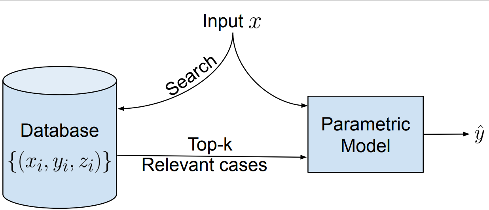

## Overview

Large parametric language models have achieved dramatic empirical success across many applications. However, these models lack several desirable properties such as explainability (providing provenance), privacy (ability to remove knowledge from the model), robust controllability, and debuggability. On the other hand, nonparametric models provide many of these features by design such as provenance, ability to incorporate/remove information. However, these models often suffer from weaker empirical performance as compared to deep parametric models. 

Recently, many works have independently proposed a middle ground that combines a parametric model (that encodes logic) with a nonparametric model (that retrieves knowledge) in various areas from question answering over natural languages to complex reasoning over knowledge bases to even protein structure predictions. Given the increasingly promising results on various tasks of such[semiparametric models](https://www.google.com/url?q=https%3A%2F%2Fen.wikipedia.org%2Fwiki%2FSemiparametric_model&sa=D&sntz=1&usg=AFQjCNHRhXJVoreeuIj27m-LixysFRL4QQ), we believe this area is ripe for targeted investigation on understanding efficiency, generalization, limitations, widening its applicability, etc. As a result, we want to host a workshop on this topic.

## Call for Papers

This workshop aims to invite researchers to share their latest work in designing and understanding semiparametric models. We will welcome papers / work-in-progress on several topics (but not limited to):

1. Understanding properties and capabilities
   - Expressivity of semiparametric models
   - Generalization in low resource settings
   - Quick adaptation to newly emerging phenomena/temporally aware
   - Right to be forgotten/ GDPR /Privacy
   - Interpretability, explainability, and controllability
2. Models that do explicit reasoning with non-parametric components (than implicitly doing in parameters)
   - Case-based reasoning
   - Episodic control
   - On-the-fly Neuro-symbolic Reasoning and Neural Theorem Proving
3. Organizing non-parametric components for efficient use in semi-parametric models
   - Hierarchies/DAGs
   - Incremental Data structures
4. Applications to existing/new tasks
   - QA and Semantic Parsing
   - Structured Prediction
   - Machine Translation
   - Recommender systems
   - Information Retrieval and Extraction
   - New applications
5. Analysis and limitations of current models
   - Faithfulness to the retrieved information
   - How much retrieval is sufficient?
   - Efficiency trade-offs

## Important Dates

- TBU

## Invited Speakers

- [Andrew McCallum](https://people.cs.umass.edu/~mccallum/), University of Massachusetts, Amherst
- [Danqi Chen](https://www.cs.princeton.edu/~danqic/), Princeton University
- [Hannaneh Hajishirzi](https://homes.cs.washington.edu/~hannaneh/), University of Washington \& Allen Institute for AI
- [Jason Weston](https://ai.facebook.com/people/jason-weston/), Facebook AI Research
- TBU

## Organizing Committee
- [Rajarshi Das](http://rajarshd.github.io/), University of Massachusetts Amherst
- [Patrick Lewis](https://www.cs.cmu.edu/~bdhingra/), University College London
- [Sewon Min](https://shmsw25.github.io/), University of Washington
- [June Thai](https://uk.linkedin.com/in/piktus), University of Massachusetts Amherst
- [Manzil Zaheer](https://www.linkedin.com/in/siamak-shakeri-b0827316), Google AI

